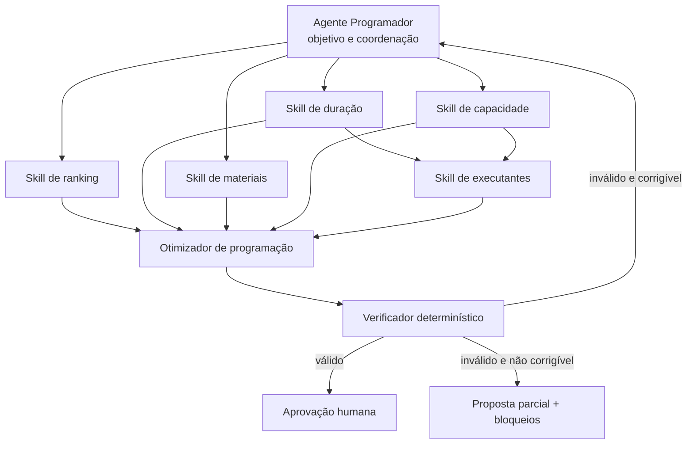

# Plano de Implementação — Agente Programador de PCM

## 1. Objetivo

Implementar um Agente Programador que gere uma proposta de programação de manutenção explicável e auditável. O agente coordena cinco skills determinísticas, um otimizador de programação e um verificador determinístico. A publicação da proposta depende de aprovação humana.

O primeiro piloto usa os dados da Planta Modelo, mas todos os contratos devem ser canônicos e identificados por `tenant_id`, evitando regras ou modelos acoplados à Tractian.

## 2. Decisão de arquitetura

As cinco capacidades serão apresentadas como skills do produto, mas inicialmente implementadas como serviços determinísticos independentes:

1. ranking do backlog;
2. estimativa de duração;
3. disponibilidade de materiais;
4. capacidade de mão de obra;
5. sugestão de executantes.

O Agente Programador é responsável por coordenar o fluxo. Ele não deve calcular scores, saldos, durações ou alocações por texto livre. Os resultados das skills convergem em um estado estruturado e versionado, consumido pelo otimizador.

Neste documento, **skill de produto** significa uma capacidade determinística com contrato tipado. Ela não é sinônimo de `SKILL.md`:

```text
skill de produto = caso de uso determinístico e testável
SKILL.md          = instrução para o agente descobrir e usar a capacidade
tool adapter      = ponte autorizada entre o agente e o caso de uso
```

Uma skill só deve ser promovida a agente autônomo quando precisar escolher dinamicamente ferramentas, executar múltiplas etapas, reagir a resultados intermediários e replanejar seu próprio caminho.

## 3. Arquitetura-alvo



### 3.1 Fluxo de execução

1. Receber `tenant_id`, período, instante de corte dos dados, pesos e restrições.
2. Carregar e validar o snapshot canônico de ordens, ativos, pessoas, escalas, materiais e janelas.
3. Executar ranking, duração, materiais e capacidade em paralelo.
4. Consolidar os resultados no estado enriquecido das ordens.
5. Gerar candidatos a executante usando duração, capacidade e histórico.
6. Executar o otimizador com todos os resultados estruturados.
7. Verificar invariantes da proposta.
8. Quando houver conflito corrigível, ajustar restrições e repetir somente a etapa necessária, com limite de tentativas.
9. Entregar proposta válida ou parcial para revisão humana.
10. Registrar aprovação, ajuste ou rejeição sem sobrescrever a sugestão original.

### 3.2 Regra central de negócio

Prioridade, prontidão e programabilidade não são o mesmo conceito e não devem ser combinados em um único score opaco.

```text
priority_score       = urgência e impacto da OS
readiness_status     = dados, materiais, liberações e bloqueios
executability_score  = duração, capacidade, habilidade e janela
```

Uma OS muito prioritária sem material continua no topo do backlog, mas aparece como bloqueada e não é silenciosamente substituída por uma OS menos crítica.

## 4. Contratos canônicos mínimos

Os contratos devem ser modelos tipados e serializáveis. IDs externos nunca devem ser usados como chaves internas sem `tenant_id`.

### 4.1 Entrada da execução

`PlanningRequest`

- `tenant_id`;
- `period_start` e `period_end`;
- `as_of`: instante de corte usado para impedir vazamento temporal;
- `site_ids` ou escopo operacional;
- `ruleset_version`;
- `weights_version`;
- `dry_run`, inicialmente sempre verdadeiro;
- restrições e overrides autorizados.

### 4.2 Entidades de domínio

- `WorkOrderCandidate`: ordem, ativo, prioridade, abertura, vencimento, estado, operação e bloqueios.
- `AssetContext`: criticidade, localização, hierarquia e janela operacional.
- `WorkerProfile`: equipe, habilidades conhecidas e evidências históricas.
- `CapacitySlot`: pessoa/equipe, início, fim e minutos disponíveis.
- `MaterialRequirement`: item, quantidade, reserva, saldo e lead time.

### 4.3 Resultados das skills

- `PriorityAssessment`: score, faixa, componentes do score e justificativas.
- `DurationEstimate`: minutos, fonte, amostra, confiança e faixa de incerteza.
- `MaterialAssessment`: disponível, parcial, indisponível ou desconhecido; itens bloqueadores e próxima ação.
- `CapacityAssessment`: capacidade bruta, compromissos, capacidade líquida e exceções.
- `ExecutorCandidate`: pessoa/equipe, compatibilidade, capacidade restante, evidências e impedimentos.

### 4.4 Resultado consolidado

`EnrichedWorkOrder` reúne a ordem canônica e os resultados das skills sem transformar as justificativas textuais em fonte de verdade.

`ScheduleProposal` contém:

- alocações com ordem, operação, executante, início e fim;
- ordens não programadas e motivo estruturado;
- consumo de capacidade;
- conflitos e avisos;
- versões dos dados, regras, algoritmo e skills;
- evidências usadas em cada decisão.

`VerificationReport` contém violações por código, severidade, entidade afetada e possibilidade de correção automática.

A unidade básica de alocação é a **operação da OS**, pois uma ordem pode conter várias operações com durações, equipes e precedências diferentes. O ranking é calculado na OS e herdado por suas operações.

## 5. Responsabilidade de cada componente

### 5.1 Skill de ranking

Entrada: backlog elegível no instante `as_of`, configuração de SLA e pesos.

Primeira versão:

```text
score = peso_prioridade
      + peso_idade
      + peso_sla
      + peso_criticidade_quando_disponível
```

Requisitos:

- disponibilizar separadamente cada parcela do score;
- executar o Modelo A sem criticidade para todo o backlog;
- executar o Modelo B com criticidade apenas quando o dado existir;
- nunca imputar criticidade silenciosamente;
- desempatar de forma estável e documentada;
- permitir reproduzir o ranking usando `as_of`, pesos e versão das regras.

### 5.2 Skill de duração

Ordem de fallback proposta:

1. duração planejada válida;
2. mediana de operações equivalentes;
3. mediana para o mesmo ativo;
4. mediana por localização, equipe ou classe de atividade;
5. vizinhos semanticamente semelhantes pelo título;
6. padrão configurado, com baixa confiança.

Requisitos:

- treinar e avaliar somente intervalos fechados e válidos;
- excluir durações negativas, abertas, penduradas ou fora de limites configuráveis;
- usar mediana e faixa interquartil antes de modelos mais complexos;
- retornar fonte, tamanho da amostra e confiança;
- comparar estimativa, duração planejada e duração realizada.

### 5.3 Skill de materiais

Requisitos:

- calcular quantidade líquida disponível considerando saldo e reservas;
- classificar a OS como disponível, parcial, indisponível ou desconhecida;
- verificar estoque mínimo e lead time contra a data candidata;
- distinguir material sem saldo de material sem informação;
- sugerir necessidade de compra, sem abrir requisição automaticamente no MVP;
- permitir OS sem materiais quando a atividade comprovadamente não os exige.

### 5.4 Skill de capacidade

Requisitos:

- construir slots de capacidade a partir de escala, jornada, folgas e exceções;
- descontar compromissos já confirmados;
- operar por pessoa e permitir fallback por equipe;
- preservar timezone do tenant;
- impedir capacidade negativa;
- expor capacidade bruta, utilizada e líquida.

### 5.5 Skill de executantes

Primeira versão do perfil:

- equipe planejada;
- ativos e localizações atendidos anteriormente;
- frequência de execução;
- tipo de atividade, quando preenchido;
- duração realizada versus estimada;
- disponibilidade no período.

Requisitos:

- gerar uma lista ordenada de candidatos, não uma decisão irreversível;
- separar evidência de experiência de disponibilidade;
- impedir candidatos sem qualificação obrigatória, quando essa informação existir;
- indicar ausência de candidato compatível;
- nunca inferir certificação a partir de frequência histórica.

### 5.6 Otimizador de programação

O otimizador deve ser determinístico e receber apenas dados estruturados.

Primeira versão recomendada:

- baseline guloso estável para validar contratos e regras;
- em seguida, solver de programação por restrições, como CP-SAT;
- objetivo configurável e decomposto em parcelas auditáveis.

Exemplo de função objetivo:

```text
maximizar:
  prioridade atendida
  + aderência à habilidade
  + utilização saudável da capacidade
  + agrupamento operacional vantajoso

minimizar:
  atraso de SLA
  + sobrecarga
  + trocas desnecessárias
  + ordens prioritárias não programadas
```

Restrições duras iniciais:

- uma pessoa não ocupa dois slots simultâneos;
- a atividade cabe dentro da capacidade e do período;
- material bloqueador impede a alocação;
- ordens em espera ou excluídas não são programadas;
- janela operacional obrigatória é respeitada;
- quantidade mínima de executantes é respeitada;
- overrides humanos autorizados são preservados.

### 5.7 Verificador determinístico

O verificador deve recalcular as invariantes sem confiar na resposta do otimizador.

Verificações mínimas:

- colisão de agenda;
- capacidade excedida;
- executante incompatível;
- material bloqueador;
- duração ausente ou inválida;
- atividade fora da janela;
- ordem duplicada na proposta;
- ordem inexistente ou fora do snapshot;
- ausência de justificativa e evidência;
- alteração de uma alocação fixada pelo humano.

O ciclo de correção deve ter limite explícito. Após o limite, a execução termina com proposta parcial e bloqueios; nunca entra em repetição indefinida.

## 6. Organização proposta no repositório

```text
pcm-agent/
├── src/
│   ├── domain/
│   │   └── planning/
│   │       ├── entities.py
│   │       ├── value_objects.py
│   │       ├── rules.py
│   │       ├── ranking.py
│   │       ├── duration.py
│   │       ├── materials.py
│   │       ├── capacity.py
│   │       ├── executants.py
│   │       ├── optimizer.py
│   │       └── verifier.py
│   ├── application/
│   │   ├── contracts/
│   │   │   ├── snapshot.py
│   │   │   ├── skills.py
│   │   │   └── planning.py
│   │   ├── ports/
│   │   │   ├── planning_repository.py
│   │   │   └── proposal_repository.py
│   │   ├── skills/
│   │   │   ├── rank_backlog.py
│   │   │   ├── estimate_duration.py
│   │   │   ├── check_materials.py
│   │   │   ├── calculate_capacity.py
│   │   │   └── suggest_executants.py
│   │   └── workflows/
│   │       └── generate_schedule.py
│   ├── agent/
│   │   ├── programmer/
│   │   │   ├── coordinator.py
│   │   │   └── state.py
│   │   ├── tools/adapters/pcm/
│   │   │   ├── ranking.py
│   │   │   ├── duration.py
│   │   │   ├── materials.py
│   │   │   ├── capacity.py
│   │   │   ├── executants.py
│   │   │   ├── optimize.py
│   │   │   └── verify.py
│   │   └── skills/
│   │       └── pcm/
│   │           ├── ranking/SKILL.md
│   │           ├── duration/SKILL.md
│   │           ├── materials/SKILL.md
│   │           ├── capacity/SKILL.md
│   │           └── executants/SKILL.md
│   ├── infrastructure/
│   │   ├── database/
│   │   │   └── tractian/
│   │   │       ├── models.py
│   │   │       ├── queries.py
│   │   │       ├── mapper.py
│   │   │       └── repository.py
│   │   └── optimization/
│   │       ├── greedy_scheduler.py
│   │       └── ortools_scheduler.py
│   └── api/
│       └── planning.py
├── config/
│   └── tenants/
│       └── planta-modelo.yaml
├── evals/
│   ├── datasets/planning/
│   ├── cases/planning/
│   └── verifiers/planning.py
└── tests/
    ├── unit/planning/
    ├── integration/tractian/
    ├── contract/planning/
    └── end_to_end/planning/
```

Os `SKILL.md` descrevem quando e como o Agente Programador pode usar cada capacidade. O cálculo continua no domínio; a skill não duplica regra de negócio em prompt.

Não é necessário adicionar LangChain ou LangGraph no primeiro incremento. Um workflow explícito, `asyncio.TaskGroup`, contratos tipados e checkpoints são suficientes para coordenar o DAG inicial.

## 7. Roadmap incremental

Estimativa inicial para dois desenvolvedores com apoio parcial de uma pessoa de PCM:

| Fase | Duração indicativa | Dependência |
|---|---:|---|
| 0. Descoberta e congelamento | 1 semana | nenhuma |
| 1. Fundação e adaptador Planta Modelo | 1–2 semanas | Fase 0 |
| 2. Skills independentes | 2–3 semanas | Fase 1 |
| 3. Otimizador e verificador | 2 semanas | contratos da Fase 2 |
| 4. Workflow coordenador | 1 semana | Fases 2 e 3 |
| 5. Backtesting e golden set | 1–2 semanas | Fase 4 |
| 6. API e Human-in-the-Loop | 2 semanas | gate offline da Fase 5 |
| 7. Piloto sombra | 4–6 semanas corridas | Fase 6 |

O núcleo offline até o gate de backtesting representa aproximadamente 8–11 semanas. A estimativa deve ser recalibrada depois da Fase 0; disponibilidade do PCM e reconstrução temporal dos dados são os maiores fatores de incerteza.

Paralelismo possível dentro da Fase 2:

```text
ranking ────────────────┐
duração ────────┐       │
materiais ──────┼───────┼──> otimizador
capacidade ─────┤       │
                └──> executantes
```

O verificador pode começar junto com o otimizador usando fixtures e agendas deliberadamente inválidas.

### Fase 0 — Descoberta e congelamento do experimento

Objetivo: garantir que os resultados possam ser reproduzidos.

Entregas:

- dicionário das tabelas e relações Tractian usadas pelo piloto;
- confirmação das unidades de duração e timezone;
- distinção entre duração de calendário, HH total e tamanho da equipe;
- definição operacional de SLA, prioridade, bloqueio e material obrigatório;
- definição do período de treino, validação e teste;
- snapshot imutável ou manifesto com hash do dump;
- consulta que reconstrói o backlog no instante `as_of` sem olhar o futuro;
- lista dos campos com cobertura e política de ausência.

Gate: uma mesma requisição executada duas vezes sobre o mesmo snapshot produz as mesmas entradas canônicas.

### Fase 1 — Fundação de domínio e adaptador Planta Modelo

Objetivo: criar a língua comum do planejador.

Entregas:

- modelos canônicos e códigos de erro;
- portas de leitura e persistência de propostas;
- adaptador somente leitura para o schema `tractian`;
- validação de `tenant_id`, `as_of` e escopo;
- dataset analítico de ordens e operações sem dados pessoais desnecessários;
- trace mínimo com versões, tempos e contagens, sem descrições sensíveis nos logs.

Gate: testes de contrato comprovam que o domínio não depende dos nomes das tabelas Tractian.

### Fase 2 — Skills paralelas independentes

Objetivo: produzir enriquecimentos reproduzíveis antes do otimizador.

Ordem interna sugerida:

1. ranking Modelo A;
2. duração por mediana e fallbacks;
3. materiais;
4. capacidade;
5. ranking Modelo B e comparação com o Modelo A;
6. executantes, após duração e capacidade estarem estáveis.

Cada skill deve entregar:

- contrato tipado;
- implementação determinística;
- explicação baseada nas parcelas calculadas;
- política para dado ausente;
- testes unitários e de contrato;
- métricas offline;
- tempo limite e falha segura.

Gate: todas as skills conseguem processar o snapshot piloto e sinalizar registros incompletos sem interromper o lote inteiro.

### Fase 3 — Otimizador e verificador

Objetivo: gerar uma programação factível e demonstrar por que cada OS entrou ou ficou de fora.

Entregas:

- baseline guloso;
- verificador independente;
- códigos estruturados para ordens não programadas;
- teste de determinismo;
- comparação entre baseline e programação histórica;
- segunda versão com solver de restrições, se o baseline confirmar os contratos;
- limites de tempo e estratégia de melhor solução disponível.

Gate: zero violação de restrição dura no conjunto de teste. Uma proposta parcial válida é preferível a uma proposta completa inválida.

### Fase 4 — Workflow do Agente Programador

Objetivo: coordenar o DAG completo com estado persistente.

Entregas:

- execução paralela de ranking, duração, materiais e capacidade;
- junção dos resultados por chaves canônicas;
- execução dependente da skill de executantes;
- chamada do otimizador e do verificador;
- limite de correções e terminação segura;
- checkpoints após ingestão, enriquecimento, otimização e verificação;
- idempotência por tenant, período, snapshot e versão das regras;
- replay completo de uma execução.

Gate: uma falha em uma skill não causa programação silenciosa com dado ausente; o resultado é parcial ou bloqueado conforme a política.

### Fase 5 — Backtesting e golden set com o PCM

Objetivo: avaliar utilidade, não apenas funcionamento técnico.

Entregas:

- backtesting por semanas históricas sem vazamento temporal;
- comparação com programação e execução observadas;
- revisão de amostras pelo PCM;
- golden set de rankings, durações, materiais, executantes e programações;
- relatório de falhas por categoria;
- calibragem de pesos e regras por configuração, sem alterar código.

Gate: especialistas concordam com os critérios de avaliação e aprovam o comportamento mínimo para dry-run.

### Fase 6 — API, portal e Human-in-the-Loop

Objetivo: permitir uso controlado sem escrita automática no sistema de origem.

Endpoints iniciais:

- `POST /planning/proposals`;
- `GET /planning/proposals/{proposal_id}`;
- `POST /planning/proposals/{proposal_id}/simulate-adjustment`;
- `POST /planning/proposals/{proposal_id}/decision`.

Entregas:

- tela da programação e dos bloqueios;
- comparação sugestão versus decisão;
- ajuste de executante, data, horário e duração;
- revalidação após todo ajuste;
- registro de aprovação, rejeição ou alteração;
- exportação em arquivo antes de qualquer integração de escrita.

Gate: o PCM consegue revisar e aprovar uma semana sem perda da proposta original e sem escrita direta na Tractian.

### Fase 7 — Piloto assistido e evolução

Objetivo: operar em sombra antes de apoiar uma decisão real.

Etapas:

1. modo sombra, sem exibir a sugestão durante a decisão humana;
2. comparação entre proposta automática e planejamento real;
3. modo copiloto, com proposta editável;
4. exportação controlada;
5. integração de escrita apenas após política, autorização, idempotência e rollback.

Somente após o piloto devem ser avaliados LLM para explicações, regras em linguagem natural ou promoção de alguma skill a agente.

## 8. Estratégia inicial de testes com os dados Planta Modelo

### 8.1 Cortes temporais

- treino inicial sugerido: janeiro a abril de 2026;
- validação inicial sugerida: maio de 2026;
- backtesting inicial sugerido: pelo menos seis semanas móveis de junho e julho de 2026;
- toda feature usa apenas informações disponíveis até `as_of`.

O histórico disponível é curto, aproximadamente de janeiro a julho de 2026. Por isso, a avaliação deve usar validação temporal, nunca divisão aleatória de linhas.

### 8.2 Métricas por componente

Ranking:

- recall de ordens vencidas e muito prioritárias no topo do ranking;
- estabilidade do ranking;
- concordância e divergência com a programação histórica;
- cobertura do Modelo A versus Modelo B;
- 100% dos casos sintéticos de monotonicidade;
- comparação com o baseline de prioridade pura e revisão de 50 a 100 pares pelo PCM.

Duração:

- erro absoluto mediano em minutos;
- erro percentual absoluto mediano, com proteção para valores próximos de zero;
- cobertura da faixa estimada;
- percentual por fonte de fallback e confiança;
- comparação com duração planejada e mediana global, buscando melhora inicial de pelo menos 10% no erro antes de adotar modelo mais complexo.

Materiais:

- cobertura de ordens com relação explícita de material;
- acurácia dos estados disponível, parcial e indisponível em amostra revisada;
- falsos positivos de bloqueio;
- divergência entre saldo, reserva e retirada posterior.

Capacidade:

- diferença entre capacidade calculada e agenda conhecida;
- conflitos detectados;
- capacidade negativa ou duplicada, que deve ser zero;
- cobertura de executantes com escala conhecida.

Executantes:

- presença do executante histórico no top 1, top 3 e top 5;
- cobertura de ordens com ao menos um candidato;
- violações de equipe ou qualificação, que devem ser zero quando houver regra explícita;
- distribuição de carga para detectar concentração indevida;
- Recall@3 superior ao baseline do executante mais frequente da equipe; o histórico é um rótulo fraco e não representa necessariamente a melhor escolha.

Programação:

- zero conflito duro;
- prioridade total atendida;
- percentual do backlog elegível programado;
- utilização de capacidade sem sobrecarga;
- ordens vencidas programadas;
- taxa de material bloqueador respeitado;
- divergência da programação humana, acompanhada de motivo, sem assumir que o histórico humano é sempre correto;
- solução viável em até 30 segundos no baseline e solução final dentro de limite configurável de até dois minutos para a semana piloto.

### 8.3 Limitações conhecidas do piloto

- criticidade existe para poucos ativos;
- parte relevante das ordens não tem descrição;
- tipo de atividade possui cobertura limitada;
- histórico de executantes não comprova certificação;
- intervalos abertos e em progresso têm durações acumuladas inadequadas para treino;
- duas pessoas trabalhando uma hora representam uma hora de calendário e duas HH; essas medidas não podem ser confundidas;
- ainda é necessário validar a semântica de data planejada versus reprogramações;
- o saldo atual não pode ser usado como estoque histórico; se movimentos e reservas não permitirem reconstrução em `as_of`, o backtest de materiais deve ser marcado como inconclusivo;
- dados de pessoas devem ser pseudonimizados nos datasets de avaliação.

## 9. Critérios de conclusão do MVP

O MVP é considerado concluído quando:

- o backlog é reconstruído para um `as_of` conhecido;
- toda ordem recebe prioridade ou motivo estruturado de falha;
- duração retorna estimativa e confiança, ou ausência explícita;
- materiais retornam prontidão sem confundir falta de dado com falta de saldo;
- capacidade é calculada por pessoa ou equipe sem valores negativos;
- candidatos a executante possuem evidências e disponibilidade;
- o otimizador produz proposta válida ou parcial;
- o verificador detecta todas as violações artificiais do conjunto de testes;
- o resultado é reproduzível e auditável;
- uma pessoa pode ajustar e aprovar a proposta;
- nenhuma escrita ocorre no sistema de origem.

## 10. Fora do MVP

- abertura automática de compras;
- transferência automática entre estoques;
- escrita direta de programação na Tractian;
- aprendizado online sem revisão;
- inferência de certificações;
- negociação autônoma entre agentes;
- Knowledge Graph;
- LLM decidindo prioridade, duração ou alocação;
- promoção das skills a agentes completos.

## 11. Decisões que precisam de validação do PCM

Estas respostas refinam o plano, mas não impedem a Fase 0:

1. Qual data representa o SLA: `due_date` diretamente ou uma regra calculada por prioridade?
2. Uma OS sem material relacionado significa “não requer material” ou “material não cadastrado”?
3. A duração planejada está armazenada em segundos e representa uma pessoa ou o esforço total da equipe?
4. Quais estados de ordem tornam a OS elegível, bloqueada ou apenas informativa?
5. A programação piloto será por pessoa, por equipe ou tentará pessoa com fallback para equipe?
6. Quais qualificações são restrições obrigatórias e onde estão registradas hoje?
7. Quais janelas operacionais são restrições duras e quais podem ser excepcionadas?
8. Qual é o ciclo oficial da semana de manutenção e quando o snapshot deve ser capturado?
9. Qual objetivo deve prevalecer quando não cabe tudo: SLA, criticidade, quantidade de OS, ocupação de HH ou outro?
10. Quem pode aprovar exceções e publicar a programação?

## 12. Stack mínima sugerida

Runtime e contratos:

- Python 3.12;
- Pydantic v2 e `pydantic-settings`;
- SQLAlchemy e psycopg;
- PyYAML para regras e perfis versionados;
- OR-Tools somente após o baseline guloso;
- logs estruturados e OpenTelemetry.

Testes e qualidade:

- pytest e pytest-asyncio;
- Hypothesis para invariantes e testes gerativos;
- Testcontainers para o adaptador PostgreSQL;
- Ruff e mypy.

FastAPI e Uvicorn entram na fase de API. Um provider de LLM não é dependência do núcleo determinístico.

## 13. Primeiro incremento executável

O primeiro incremento deve terminar com um comando offline semelhante a:

```text
generate-proposal \
  --tenant planta-modelo \
  --period-start AAAA-MM-DD \
  --period-end AAAA-MM-DD \
  --as-of AAAA-MM-DDTHH:MM:SSZ \
  --dry-run
```

O comando deve produzir:

- `proposal.json`, com alocações e ordens não programadas;
- `verification.json`, com invariantes e violações;
- `summary.json`, com métricas do lote;
- `trace.jsonl`, com versões e eventos sem dados pessoais desnecessários.

Esse incremento valida o núcleo inteiro antes de adicionar API, portal, LLM ou escrita em sistemas externos.
